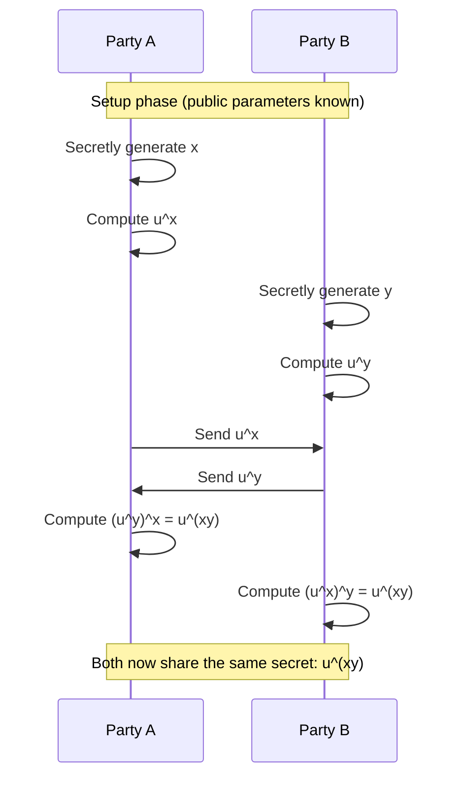

# the definitive last article that you will need for digital security

Best of my knowledge about digital security in one place!


Digital security for engineering seems daunting and a difficult subject to deal with : this is why I've written this article - to make it accessible to everybody and keep it extremely practical, to actually relate to all the math and the numbers and certificates with real life.

## History

So, let's begin, let's start the story about 3000 years ago:
The first instance of encrypted was noted around the era of "Alexander the Great" - because he had a problem : his territories were so large that he couldn't be everywhere at once; he needed to send messages to his trusted generals, so that they are able to execute this commands. 

However, if this message is intercepted in the middle, then the strategy fails. 

Hence, he came up with this rather simple solution :


A rope is wrapped around on a stick of a known diameter, then a message is written out on only one line, say "Attack at dawn" and the others are completely gibberish.
Then the rope is unwrapped and sent to the generals, unless you have the stick with the same diameter as the original, there is no chance that you are going to read the message ( well, at least 3000 years ago when there were no computers and education was not common ).


But let us observe what happened there,

Mathematically,

$$
cipherText = f ( msg , key )
$$

$$
msg = f' ( cipherText , key )
$$

The above technique, had a "function" that would convert the readable message to an unreadable message for a normal person, however, if you have a key, then this "cipher text" can be recovered to the original message.


This method of converting a message to an unreadable format unless you have a key is known as **"encryption"** & if you have a singular key that does the encryption & decryption it's known as **"symmetric encryption"**

---

Remember, these key differences :


- **encryption** : is the activity to mutate ( encrypt ) your data such that even though if it's left in public, then only the person with the key should be able to read ( decrypt ) it.
- **encoding** : is just a translation from one characters to another - this is typically done to avoid special characters, esp. in scenarios where new characters are unsupported. e.g., using emoji's in legacy database "😂" emoji is encoded to : U+1F602 to store in legacy database and the frontend will take the headache of converting it back to emoji 😂.
- **steganography** : is the activity where your data is hidden amongst other larger set of data.

this article will stick to encryption - no usage of encoding or steganography here!

---

## Example of modern symmetric encryptions 

Of course the scytale cipher isn't complex to break anymore, but we do use better symmetric encryption algorithms now. The most popular one is AES ( Advanced Encryption Standard ).

### Encryption :

```shell
echo "your message" | openssl enc -aes-256-cbc -salt -pbkdf2 -a -pass pass:yourkey

# output : U2FsdGVkX1/l5llR2vDIoFCz1Ysbk99hGSwZAEOcjGs
```

### Decryption

```shell
echo "U2FsdGVkX1/l5llR2vDIoFCz1Ysbk99hGSwZAEOcjGs" | openssl enc -d -aes-256-cbc -pbkdf2 -a -pass pass:yourkey

# Output : your message
```

### Points to note and experiment

- tampering the key or the cipher text will always lead to an error.
- in modern encrpytion algorithms, attempting the same encrpytion repeatedly. i.e., using the same key & message may still lead to different output - this trick is known as `salting` - this will not be covered in this article, perhaps another `.md` file.
- modern encryption algorithms, "chain" blocks due to advanced pattern recoginition software that is available now, this trick is known as `cipher-block-chaining` , or `CBC` e.g.,


  

If poorly encrypted, then even the best algorithm can't help!

---

## Main weakness of symmetric encryption

> that KEY - it needs to be transferred securely, if the key is leaked then the entire exchange is compromised.

### how then, shall we securely exchange a key when the messenger is unreliable?

> by using a 8th standard mathematical trick.


$$
((u)^x)^y = ((u)^y)^x
$$
$$
u^{xy} = u^{yx}
$$

---


if you think about it - unless you know the values of $x$ or $y$ , you cannot compute the value of $u^{xy}$ with just $u^x$ and $u^y$, sure, you can reach $u^{x+y}$ and even $u^{x-y}$ but not $u^{xy}$ 

This is the power of mathematics at play, but yes, there is a major glaring flaw 😂

If $u$ is leaked ( which is you will see below is public information ) , then it's childs play to perform $log_{u}(u^x)$ and extract out $x$

Well, we have a solution for that as well, it's called the Diffie Hellman Key Exchange Algorithm

---

## Diffie - Hellman Key Exchange Algorithm

1. Choose a publically available base number $p$ & modulo $k$
2. Both parties will chose their own private numbers $x$ and $y$
3. Each party perform $p^x mod(k)$ - these numbers are transmitted over insecure network.
4. After reception, they will use their private numbers again to reach to compute : $(p^x)^y mod(k)$ & $(p^y)^x mod(k)$
5. Both parties have reached the same conclusion, over an insecure network

$$
p^{xy} mod (k)
$$

6. this common conclusion that the both parties have reached - will be used as the encryption key for symmetric key encryption.

> note that this is a key exchange, not actual information exchange, you will not be able to transmit actual information with this algorithm alone, it has to be used along with symmetric key encryption for full effect.

---

## Demo in python with simple numbers

let's observe the key exchange in action with real workable numbers:

assume that :
```shell
u = 5      # the base number
k = 135    # the modulo
x = 8      # private number of LHS
y = 9      # private number of RHS
```

](https://raw.githubusercontent.com/tsamridh86/security-documentation/refs/heads/main/dhke.gif)

1. the LHS sends over 70, not it's secret 8
2. the RHS sends over 80, not it's secret 9
3. the LHS then uses the obtained 80 and raises it's power by it's own secret 8 and then the modulo to reach the answer
4. the RHS then uses the obtained 70 and raises it's power by it's own secret 9 and then the modulo to reach the answer.
5. both parties reach the same number 55 at the end - this value is to be used as the key for the symmetric key encryption.
6. this final key is used as the key by both parties.

### Full read up about the algorithm
> https://en.wikipedia.org/wiki/Diffie%E2%80%93Hellman_key_exchange

---

## Another problem with the key exchange!

### how do i trust that the key wasn't intercepted in the middle?

after all, if i perform this key exchange with someone performing an impersonation of the destination, then i'm exposed to "man in the middle attack".

> ## solution : RSA algorithm

---

## RSA Algorithm

full readup is available here : https://simple.wikipedia.org/wiki/RSA_algorithm

internal mathematics have been skipped for now, perhaps another `.md` file in the future.

but mathematically, this is what the rsa algorithm does.

$$
cipher = rsa ( msg , private key )
$$

$$
msg = rsa ( cipher , public key )
$$

> note that a message encrypted by private key can only be opened by the publically avialable key - this establishes `authenticity` --> only one person on that planet could have written that message.

conversely,

$$
cipher = rsa ( msg , public key )
$$

$$
msg = rsa ( cipher , private key )
$$

> a message encrypted by the public key can only be opened by the private key - this establishes `integrity` --> only one person in the world will ever read that message.

---

### practical demo

1. generate a private key & public key
```shell
openssl genpkey -algorithm RSA -out private.pem -pkeyopt rsa_keygen_bits:2048

open rsa -pubout -in private.pem -out public.pem
```
2. Encrypt a message with the public key
```shell
echo "Hello, RSA!" | openssl rsautl -encrypt -pubin -inkey public.pem -out encrypted.bin
```
3. Have a look at the output
```shell
openssl base64 -in encrypted.bin
```
4. Decrypt the message with the private key
```shell
openssl rsautl -decrypt -inkey private.pem -in encrypted.bin
```
---

> **critical thinking** : if i encrypt a message using the private key, and if anyone can decrypt it using the publically available key... why should i waste compute power encrypting large input messages?

>  think at the scale of if you want to prove that you wrote this novel - instead of signing the entire input, you only sign the hash of the input - that's plenty to prove authenticity.

thankfully, people who made `openssl` had the same smart thinking - in `openssl` you can only `sign` a message using the private key, there is no facility to "encrypt" a message using the private key.

this implies,

$$
    digitialSignature = rsa ( hash ( message ), private key)
$$

> the command to generate a signature is left as an exercise.

* hashes are also not covered here - perhaps some other day.

with the RSA algorithm, we are able to prove both authenticity and integrity of the message, but... 

---

## if i have never met you, how can I trust that you are who you say you are?

> trust CANNOT be mathematically established
>>sidetrack : blockchains are "trustless" systems, they agree on a "consensus" ( which is typically an algorith they agree on like proof-of-work ) there is no "trust"

since, "trust" can never be mathematically established : we have to trust someone in the end.

we have a list of people that we trust in the world, their information is stored in `/etc/ssl/certs` directory, these people are called the `CA` : `certifying authority`

if we see the "digital signature" of a trusted CA in a website, then we trust the website.

