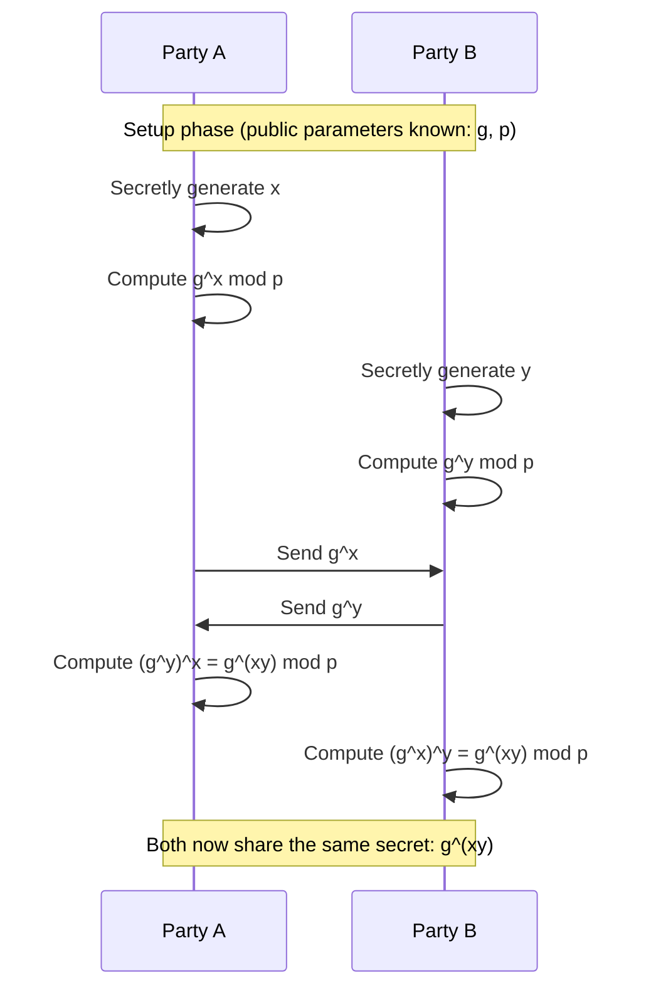
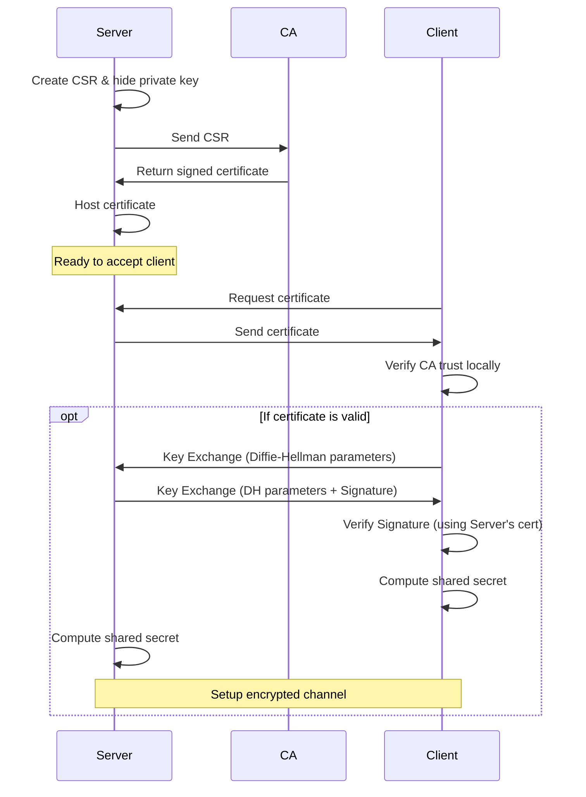

# The definitive guide to digital security

Everything I know about digital security in one place!

Digital security for engineering often seems daunting and difficult to deal with. That is why I've written this article: to make it accessible to everybody and keep it extremely practical, relating all the math, numbers, and certificates to real life.

## History

So, let's begin the story about 3000 years ago.

The first instance of **encryption** was noted around the era of the Spartans (approx 400 BC). They had a problem: their territories were effectively managed by generals who needed to receive secret commands.

However, if a message were intercepted in the middle, the strategy would fail.

Hence, he came up with a rather simple solution:


A rope is wrapped around a stick of a known diameter. A message is then written on only one line, say "Attack at dawn," while the other lines contain gibberish.
When the rope is unwrapped, it appears as random letters. Unless you have a stick with the same diameter as the original (the "key"), there is no chance you are going to read the message (well, at least 3000 years ago when computers didn't exist).


Let us observe what happened there.

Mathematically,

$$
cipherText = f ( msg , key )
$$

$$
msg = f' ( cipherText , key )
$$

The above technique used a "function" that would convert the readable message into an unreadable format for a normal person. However, if you have the key, then this "ciphertext" can be recovered to the original message.


This method of converting a message to an unreadable format is known as **"encryption"**. If you have a singular key that does both the encryption and decryption, it's known as **"symmetric encryption"**.

---

Remember these key differences:


- **Encryption**: The activity of mutating (encrypting) your data so that even if it's public, only the person with the key can read (decrypt) it.
- **Encoding**: A translation from one set of characters to another. This is typically done to avoid special characters, especially where new characters are unsupported. For example, using emojis in a legacy database: the "😂" emoji might be encoded to `U+1F602` to store it, and the frontend handles converting it back to "😂".
- **Steganography**: The activity of hiding data within another larger set of data.

This article will stick to **encryption**—no encoding or steganography here!

---

## Example of modern symmetric encryption

Of course, the scytale cipher isn't complex to break anymore, but we use better symmetric encryption algorithms now. The most popular one is **AES** (Advanced Encryption Standard).

### Encryption:

```shell
echo "your message" | openssl enc -aes-256-cbc -salt -pbkdf2 -a -pass pass:yourkey

# output : U2FsdGVkX1/l5llR2vDIoFCz1Ysbk99hGSwZAEOcjGs
```

### Decryption

```shell
echo "U2FsdGVkX1/l5llR2vDIoFCz1Ysbk99hGSwZAEOcjGs" | openssl enc -d -aes-256-cbc -pbkdf2 -a -pass pass:yourkey

# Output : your message
```

### Points to note and experiment

- Tampering with the key or the ciphertext will always lead to an error.
- In modern encryption algorithms, attempting the same encryption repeatedly (i.e., using the same key & message) may still lead to different output. This is due to `salting`, which prevents attackers from seeing patterns.
- Modern encryption algorithms "chain" blocks together to prevent pattern analysis. This is known as `Cipher-Block-Chaining` or `CBC`. For example:


  

If poorly encrypted, then even the best algorithm can't help!

---

## Main weakness of symmetric encryption

> **The KEY**. It needs to be transferred securely. If the key is leaked, the entire exchange is compromised.

### How then shall we securely exchange a key when the messenger is unreliable?

> By using a mathematical trick involving 8th standard math.

$$
((g)^x)^y = ((g)^y)^x
$$
$$
g^{xy} = g^{yx}
$$

---


If you think about it, unless you know the values of $x$ or $y$, you cannot compute the value of $g^{xy}$ with just $g^x$ and $g^y$.

This is the power of mathematics at play, but yes, there is a major glaring flaw. 😂

If $g$ is leaked (which, as you will see below, is public information), then it's child's play to perform $\log_{g}(g^x)$ and extract $x$.

Well, we have a solution for that as well. It's called the **Diffie-Hellman Key Exchange Algorithm**, and it relies on **Modular Arithmetic**. In modular arithmetic, reversing this operation (the Discrete Logarithm Problem) is incredibly difficult.

---

## Diffie-Hellman Key Exchange Algorithm

1. Choose a publicly available base number $g$ & modulo $p$.
2. Both parties choose their own private numbers $x$ and $y$.
3. Each party performs $g^x \pmod p$. These numbers are transmitted over an insecure network.
4. After reception, they use their private numbers again to compute: $(g^x)^y \pmod p$ & $(g^y)^x \pmod p$.
5. Both parties have reached the same conclusion over an insecure network:

$$
g^{xy} \pmod p
$$

6. This common conclusion that both parties have reached will be used as the **encryption key** for symmetric key encryption.

> **Note**: This is a key exchange, not an actual information exchange. You generally cannot transmit actual information with this algorithm alone. It has to be used along with symmetric key encryption for full effect.

---

## Demo in Python with simple numbers

Let's observe the key exchange in action with real workable numbers.

Assume that:
```shell
g = 5      # the base number
p = 135    # the modulo
x = 8      # private number of LHS
y = 9      # private number of RHS
```


1. The LHS sends over `70`, not its secret `8`.
2. The RHS sends over `80`, not its secret `9`.
3. The LHS then uses the obtained `80`, raises it to the power of its own secret `8`, and then applies the modulo to reach the answer.
4. The RHS then uses the obtained `70`, raises it to the power of its own secret `9`, and then applies the modulo to reach the answer.
5. Both parties reach the same number `55` at the end—this value is to be used as the key for symmetric key encryption.

### Full read up about the algorithm
> https://en.wikipedia.org/wiki/Diffie%E2%80%93Hellman_key_exchange

---

## Another problem with the key exchange!

### How do I trust that the key wasn't intercepted in the middle?

After all, if I perform this key exchange with someone impersonating the destination, then I'm exposed to a **"man-in-the-middle attack"**.

> **Solution: RSA Algorithm**

---

## RSA Algorithm

A full read-up is available here: https://simple.wikipedia.org/wiki/RSA_algorithm

Internal mathematics have been skipped for now.

Mathematically, this is what the RSA algorithm does:

$$
cipher = rsa(msg, private\_key)
$$

$$
msg = rsa(cipher, public\_key)
$$

> **Note**: A message encrypted by a private key can only be opened by the publicly available key. This establishes **Authenticity** -> Only one person on the planet could have written that message.

Conversely,

$$
cipher = rsa(msg, public\_key)
$$

$$
msg = rsa(cipher, private\_key)
$$

> **Note**: A message encrypted by the public key can only be opened by the private key. This establishes **Confidentiality** -> Only one person in the world will ever read that message.

---

### Practical demo

1. Generate a private key & public key:
```shell
openssl genpkey -algorithm RSA -out private.pem -pkeyopt rsa_keygen_bits:2048

openssl rsa -pubout -in private.pem -out public.pem
```
2. Encrypt a message with the public key:
```shell
echo "Hello, RSA!" | openssl rsautl -encrypt -pubin -inkey public.pem -out encrypted.bin
```
3. Have a look at the output:
```shell
openssl base64 -in encrypted.bin
```
4. Decrypt the message with the private key:
```shell
openssl rsautl -decrypt -inkey private.pem -in encrypted.bin
```
---

> **Critical Thinking**: If I encrypt a message using the private key, and anyone can decrypt it using the publicly available key... why should I waste compute power encrypting large input messages?

> **Answer**: Think at the scale of proving authorship used in signing. If you want to prove that you wrote a novel, you don't need to sign the entire text. Instead, you only sign the **hash** of the input. That's plenty to prove **authenticity**.

Thankfully, the creators of `openssl` had the same smart thinking. In `openssl`, you can only **sign** a message using the private key; there is no facility to "encrypt" a message using the private key (which is effectively signing).

This implies:

$$
    digitalSignature = rsa(hash(message), private\_key)
$$

> The command to generate a signature is left as an exercise.

---
## Hashes

A **hash** is a mathematical function that converts an input (or 'message') of any length into a fixed-size string of bytes. The output (often called the `digest`) looks completely random, but it is **deterministic**—the same input will always produce the exact same hash.

With simple hashing techniques, it can be easy to figure out the input even if you only have the output. However, a **cryptographic hash function** is designed to be computationally infeasible to reverse (i.e., find the input given the output).

$$
hash = H(message)
$$

### Why were they needed?

1.  **Integrity**: How do you know a file you downloaded hasn't been corrupted or tampered with? Comparing the file byte-for-byte is slow. Comparing their hashes is instant.

> The source sends the main file as well as its hash string. The destination re-computes the hash of the received file and compares it with the hash string sent by the source.

2.  **Efficiency in Signing**: As mentioned in the RSA section above, encrypting a massive file (like a novel or video) with a private key is computationally expensive. Instead, we hash the file (which is fast) and sign the hash (which is small).
3.  **Password Security**: Storing passwords in plain text is dangerous. If we store the hash of the password, even if the database is leaked, the attacker only gets the hashes, not the actual passwords. (Since we use cryptographic hashes, it is computationally infeasible to reverse the hash to retrieve the password).

### Usage

- **Digital Signatures**: Combining Hashes + Asymmetric Encryption (RSA) = Digital Signature.
- **Commit IDs**: Git uses SHA-1 hashes to uniquely identify the state of the code.
- **File Integrity**: Verifying checksums of downloaded files.

### Generating a Hash using OpenSSL

We can use the `openssl dgst` (digest) command. Here is an example using `SHA-256`:

```shell
# Note: echo adds a newline by default, use -n to suppress it for exact string hashing
echo -n "hello world" | openssl dgst -sha256
# Output: (stdin)= b94d27b9934d3e08a52e52d7da7dabfac484efe37a5380ee9088f7ace2efcde9
```

> **Note**: `openssl` uses a cryptographic hash function, so if you try changing just one letter, you will see that the hash changes completely. This is called the **Avalanche Effect**, making it extremely difficult to find patterns or trace the source.

```shell
echo -n "Hello world" | openssl dgst -sha256
# Output: (stdin)= 64ec88ca00b268e5ba1a35678a1b5316d212f4f366b2477232534a8aeca37f3c
```

> There is nothing wrong with "classical" hash functions—they have their own uses, especially in memory management (like hash maps). But when dealing with security, we almost always use **cryptographic** hash functions. **Side quest completed!**

---

With the RSA algorithm, we are able to prove both authenticity and confidentiality of the message, but... 

---

## If I have never met you, how can I trust that you are who you say you are?

> **Trust CANNOT be mathematically established.**
>
> *Sidetrack*: Blockchains are "trustless" systems. They agree on a "consensus" (typically via an algorithm like proof-of-work), so there is no need for "human trust".

Since "trust" can never be mathematically established, we have to trust someone in the end.

We have a list of people that we trust in the world. Their information is stored in the `/etc/ssl/certs` directory (or similar). These entities are called **CAs** (**Certifying Authorities**).

If we see the "digital signature" of a trusted CA on a website, then we trust the website.


---

## How to make my own certificate?
0. The website owner creates its own private key and never shares it.
1. Write a message that will be shown to the public, called a `Certificate Signing Request` (Step 0 is done here in one shot):
```shell
openssl req -new -sha256 -nodes -out my-website.domain.com.csr -newkey rsa:2048 -keyout private.key -config <(
cat <<-EOF
[ req ]
default_bits = 2048
prompt = no
default_md = sha256
req_extensions = req_ext
distinguished_name = dn

[ dn ]
C = IN
ST = Maharashtra
L = Pune
O = My Organization
OU = My Unit
CN = my-website.domain.com

[ req_ext ]
subjectAltName = @alt_names

[ alt_names ]
DNS.1 = my-website.domain.com
EOF
)

```
2. This "message" or CSR is sent to the `CA`.
3. CA will sign this certificate and return it back to you. Say you received `certificate.crt`.
4. Upload it to your server, ( nodejs example below)

```javascript
const fs = require('fs');
const http = require('http');
const https = require('https');
const express = require('express');

const app = express();

// HTTP Server (Insecure)
http.createServer(app).listen(80, () => {
  console.log('HTTP server running on port 80');
});

// HTTPS Server (Secure)
const options = {
  key: fs.readFileSync('private.key'),
  cert: fs.readFileSync('certificate.crt')
};

https.createServer(options, app).listen(443, () => {
  console.log('HTTPS server running on port 443');
});
```

---

## What does the CA actually do?
0. The CA has its own private key and a **"root key"**
> The root key is a private key with extra information, such as the CA's name, organization, etc.
```shell
# this command generates the key and the root key in one shot
openssl req -x509 \
            -sha256 -nodes \
            -days 3650 \
            -newkey rsa:4096 \
            -keyout ca.key \
            -out ca.crt
```

1. The CA verifies your identity (this is the "trust" part).
2. The CA signs your certificate:
```shell
openssl x509 -req -in my-website.domain.com.csr -CA ca.crt -CAkey ca.key -CAcreateserial -out certificate.crt -days 365 -sha256
```

3. The CA makes its public key available to the world.
4. When a user visits your website, their browser checks the CA's signature on your certificate.
5. If the signature is valid, the browser trusts your website.


---

## HTTPS Workflow - bringing it all together




# END for now
**authz is still pending 😉**