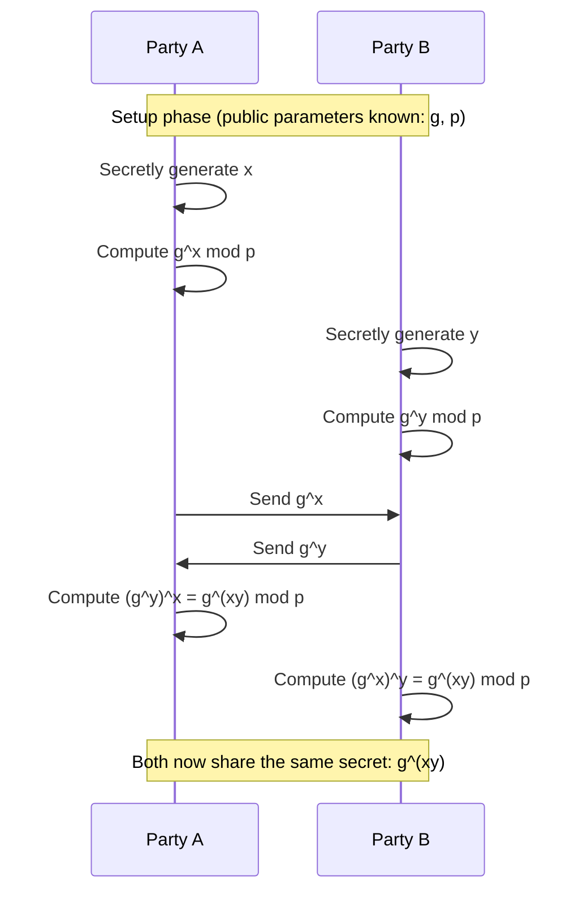

# The Key Exchange Problem & Diffie-Hellman

## Main weakness of symmetric encryption

> **The KEY**. It needs to be transferred securely. If the key is leaked, the entire exchange is compromised.

### How then shall we securely exchange a key when the messenger is unreliable?

> By using a mathematical trick involving 8th standard math.

$$
((g)^x)^y = ((g)^y)^x
$$
$$
g^{xy} = g^{yx}
$$

---


If you think about it, unless you know the values of $x$ or $y$, you cannot compute the value of $g^{xy}$ with just $g^x$ and $g^y$.

This is the power of mathematics at play, but yes, there is a major glaring flaw. 😂

If $g$ is leaked (which, as you will see below, is public information), then it's child's play to perform $\log_{g}(g^x)$ and extract $x$.

Well, we have a solution for that as well. It's called the **Diffie-Hellman Key Exchange Algorithm**, and it relies on **Modular Arithmetic**. In modular arithmetic, reversing this operation (the Discrete Logarithm Problem) is incredibly difficult.

---

## Diffie-Hellman Key Exchange Algorithm

1. Choose a publicly available base number $g$ & modulo $p$.
2. Both parties choose their own private numbers $x$ and $y$.
3. Each party performs $g^x \pmod p$. These numbers are transmitted over an insecure network.
4. After reception, they use their private numbers again to compute: $(g^x)^y \pmod p$ & $(g^y)^x \pmod p$.
5. Both parties have reached the same conclusion over an insecure network:

$$
g^{xy} \pmod p
$$

6. This common conclusion that both parties have reached will be used as the **encryption key** for symmetric key encryption.

> **Note**: This is a key exchange, not an actual information exchange. You generally cannot transmit actual information with this algorithm alone. It has to be used along with symmetric key encryption for full effect.

---

## Demo in Python with simple numbers

Let's observe the key exchange in action with real workable numbers.

Assume that:
```shell
g = 5      # the base number
p = 135    # the modulo
x = 8      # private number of LHS
y = 9      # private number of RHS
```


1. The LHS sends over `70`, not its secret `8`.
2. The RHS sends over `80`, not its secret `9`.
3. The LHS then uses the obtained `80`, raises it to the power of its own secret `8`, and then applies the modulo to reach the answer.
4. The RHS then uses the obtained `70`, raises it to the power of its own secret `9`, and then applies the modulo to reach the answer.
5. Both parties reach the same number `55` at the end—this value is to be used as the key for symmetric key encryption.

### Full read up about the algorithm
> https://en.wikipedia.org/wiki/Diffie%E2%80%93Hellman_key_exchange

---

[**← Previous: History**](./01-history-and-basics.md) | [**🏠 Home**](../README.md) | [**Next: RSA & Asymmetric Encryption →**](./03-rsa-and-asymmetric.md)
