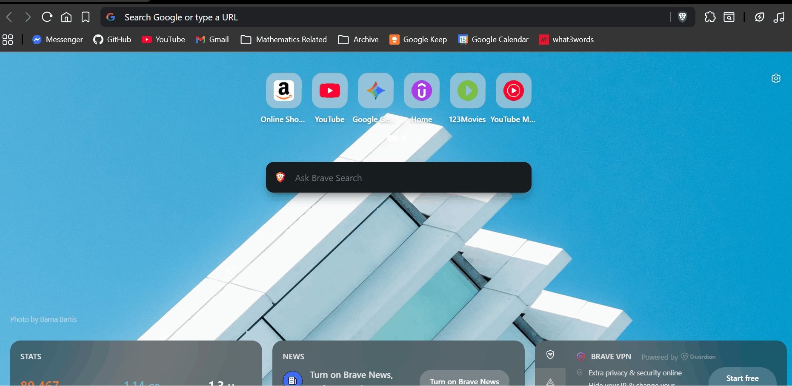
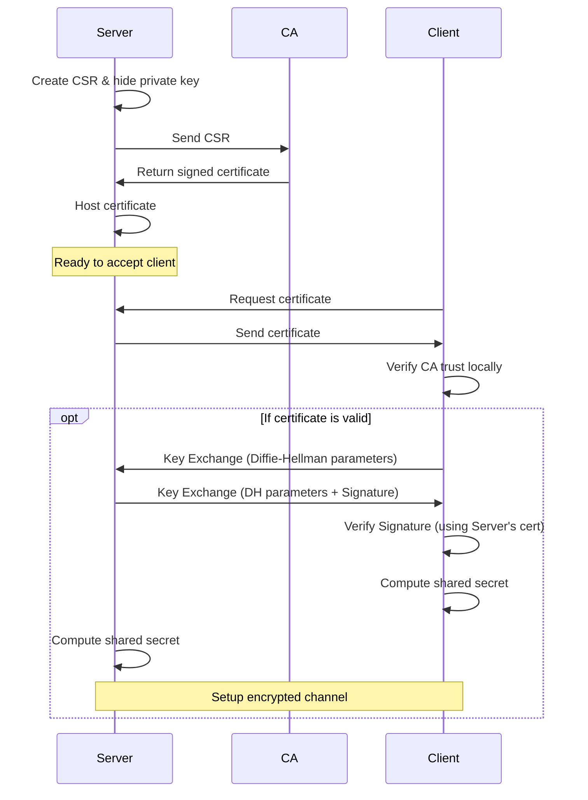

# PKIs, Certificates, and HTTPS

With the RSA algorithm, we are able to prove both authenticity and confidentiality of the message, but... 

> *Quick side note : PKI stands for public key infrastructure, why infrastructure will be clear till then end*

---

## If I have never met you, how can I trust that you are who you say you are?

> **Trust CANNOT be mathematically established.**
>
> *Sidetrack*: Blockchains are "trustless" systems. They agree on a "consensus" (typically via an algorithm like proof-of-work), so there is no need for "human trust".

Since "trust" can never be mathematically established, we have to trust someone in the end.

We have a list of people that we trust in the world. Their information is stored in the `/etc/ssl/certs` directory (or similar). These entities are called **CAs** (**Certifying Authorities**).

If we see the "digital signature" of a trusted CA on a website, then we trust the website.



---

## How to make my own certificate?
0. The website owner creates its own private key and never shares it.
1. Write a message that will be shown to the public, called a `Certificate Signing Request` (Step 0 is done here in one shot):
```shell
openssl req -new -sha256 -nodes -out my-website.domain.com.csr -newkey rsa:2048 -keyout private.key -config <(
cat <<-EOF
[ req ]
default_bits = 2048
prompt = no
default_md = sha256
req_extensions = req_ext
distinguished_name = dn

[ dn ]
C = IN
ST = Maharashtra
L = Pune
O = My Organization
OU = My Unit
CN = my-website.domain.com

[ req_ext ]
subjectAltName = @alt_names

[ alt_names ]
DNS.1 = my-website.domain.com
EOF
)

```
2. This "message" or CSR is sent to the `CA`.
3. CA will sign this certificate and return it back to you. Say you received `certificate.crt`.
4. Upload it to your server, ( nodejs example below)

```javascript
const fs = require('fs');
const http = require('http');
const https = require('https');
const express = require('express');

const app = express();

// HTTP Server (Insecure)
http.createServer(app).listen(80, () => {
  console.log('HTTP server running on port 80');
});

// HTTPS Server (Secure)
const options = {
  key: fs.readFileSync('private.key'),
  cert: fs.readFileSync('certificate.crt')
};

https.createServer(options, app).listen(443, () => {
  console.log('HTTPS server running on port 443');
});
```

---

## What does the CA actually do?
0. The CA has its own private key and a **"root key"**
> The root key is a private key with extra information, such as the CA's name, organization, etc.
```shell
# this command generates the key and the root key in one shot
openssl req -x509 \
            -sha256 -nodes \
            -days 3650 \
            -newkey rsa:4096 \
            -keyout ca.key \
            -out ca.crt
```

1. The CA verifies your identity (this is the "trust" part).
2. The CA signs your certificate:
```shell
openssl x509 -req -in my-website.domain.com.csr -CA ca.crt -CAkey ca.key -CAcreateserial -out certificate.crt -days 365 -sha256
```

3. The CA makes its public key available to the world.
4. When a user visits your website, their browser checks the CA's signature on your certificate.
5. If the signature is valid, the browser trusts your website.


---

## HTTPS Workflow - bringing it all together




> Remember, in this case, the client is only certain who the server is - server is not certain who the client is! This should feel more akin to entering a normal store, you know the store is correct and legitimate, but the store doesn't know if you are going to purchase something or just browsing! Setting up two way certificate checks are only done in banking and high risk scenarios. This is called **"mTLS"** or **"two-way SSL"**. Your average website doesn't do two way SSL!

---

[**← Previous: Hashing**](./04-hashing-and-signatures.md) | [**🏠 Home**](../README.md) | [**Next: Authorization Concepts →**](./06-authorization-concepts.md)
