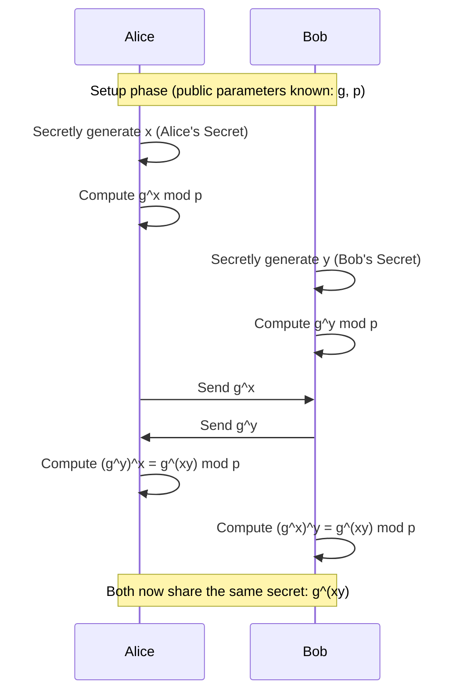
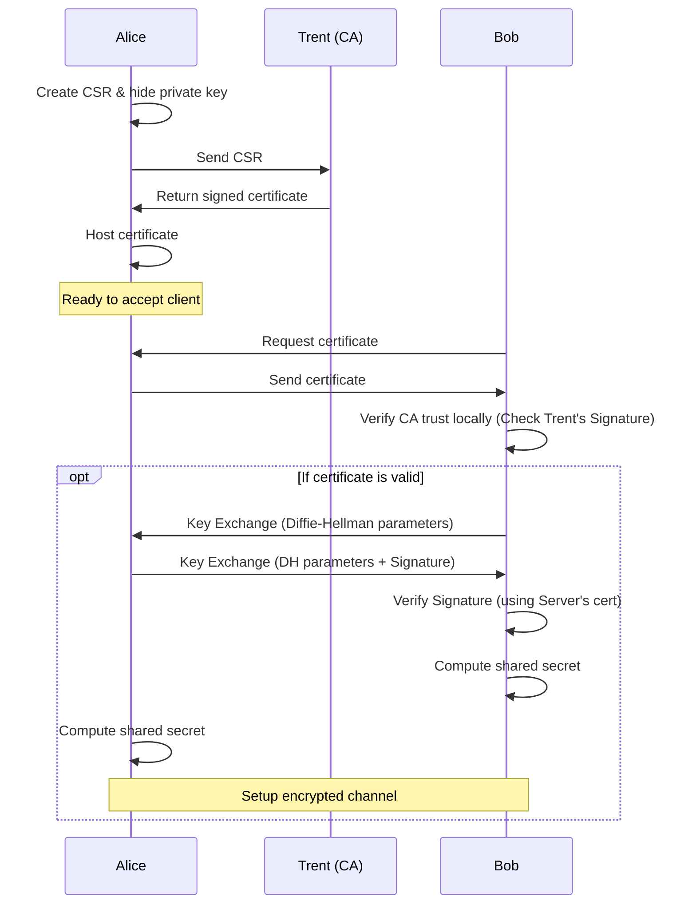

# Protocol: The Silent Echo

## Prologue: The Spartan's Legacy

The year is 2142. The world is under the iron grip of "The Syndicate," a surveillance regime that hears everything. Alice, a operative for the Resistance, sat in a dimly lit safehouse in Neo-Kyoto. She had critical intel: the location of the Syndicate's central server. She needed to get it to Bob, her handler in the Sector 7 bunker, miles away.

But the airwaves were poisoned. Every frequency was monitored by Syndicate drones.

Alice remembered history. The Spartans, 3000 years ago, faced the same dilemma. Generals needed to receive secret commands without the enemy understanding them. They used a Scytale.


"A simple stick," Alice muttered, turning a holographic cylinder in her hand. "Wrap the parchment, write the message."

*Mathematically,* she thought, tracing the logic in the air:

$$
cipherText = f ( msg , key )
$$

$$
msg = f' ( cipherText , key )
$$

It was elegant in its simplicity. If you had the key—the stick of the correct diameter—the chaos became order. If you didn't, it was just noise. This was **Symmetric Encryption**.

## Chapter 1: The Modern Shield

But a wooden stick wouldn't stop the Syndicate's quantum decrypters. Alice needed something stronger. She booted up her terminal. The resistance used **AES** (Advanced Encryption Standard) now.

She typed furiously, preparing the payload.

```shell
echo "The server is under the plaza" | openssl enc -aes-256-cbc -salt -pbkdf2 -a -pass pass:RedProtocol
```

The screen flashed the output:
```
U2FsdGVkX1/l5llR2vDIoFCz1Ysbk99hGSwZAEOcjGs
```

To decrypt it, Bob would need the perfect sequence:
```shell
echo "U2FsdGVkX1/l5llR2vDIoFCz1Ysbk99hGSwZAEOcjGs" | openssl enc -d -aes-256-cbc -pbkdf2 -a -pass pass:RedProtocol
```

Alice knew the risks. 
- Tamper with the ciphertext? Error.
- Encrypt the same message twice? **Salting** would change the output, blinding the Syndicate's pattern matchers.
- Was it unbreakable? Only if the blocks were chained correctly.

She visualized the **Cipher-Block-Chaining (CBC)** that kept her data safe:


"If poorly encrypted," she whispered, "even the best algorithm is just a paper shield."

## Chapter 2: The Handshake

A cold realization washed over her. **The Key**.

"RedProtocol." That was the password. But Bob didn't know it. If she sent the password over the network, the Syndicate would interception it. If she didn't send it, Bob couldn't read the intel.

It was the classic weakness of symmetric encryption.

She needed to exchange the key securely, right under the Syndicate's nose. She tapped into the legacy archives, pulling up the **Diffie-Hellman Protocol**.

"It's just 8th-grade math," she smirked. "A trick of exponents."

$$
((g)^x)^y = ((g)^y)^x
$$
$$
g^{xy} = g^{yx}
$$

She initiated the handshake sequence.



"Unless they know my secret $x$ or Bob's secret $y$," Alice mused, "They can't derive $g^{xy}$."

The Syndicate could see the public numbers, $g$ and $p$. They could see the transmissions. But solving the Discrete Logarithm Problem in **Modular Arithmetic** was computationally impossible for them in real-time.

She watched the numbers fly across the screen.

1.  Public base $g$ and modulo $p$ were set.
2.  She chose her private $x$. Bob chose his private $y$.
3.  She sent $g^x \pmod p$.
4.  She received Bob's calculated value and computed $(g^y)^x \pmod p$.
5.  They arrived at the same conclusion:

$$
g^{xy} \pmod p
$$

This shared secret would be their encryption key.

To visualize it, she ran a simulation with simple numbers, just to be sure.
*g = 5, p = 135, Alice's x = 8, Bob's y = 9.*


It worked. They had a shared key. But the silence in the room grew heavier.

## Chapter 3: The Ghost within the Machine

Paranoia set in. 
"How do I know that was Bob?" Alice asked the empty room.

What if **Mallory**, a Syndicate agent, had intercepted the handshake? What if Mallory pretended to be Bob to Alice, and Alice to Bob? A **Man-in-the-Middle**. The key exchange would still work, but Mallory would have the keys to everything.

She needed **RSA**.

(Full technical specs were available in the [archives](https://simple.wikipedia.org/wiki/RSA_algorithm), but she needed the practical application now.)

The math flashed in her mind:

$$
cipher = rsa(msg, private\_key)
$$
$$
msg = rsa(cipher, public\_key)
$$

"Authenticity," she said. "If I encrypt with my private key, anyone with my public key can open it. It proves I wrote it."

Conversely:

$$
cipher = rsa(msg, public\_key)
$$
$$
msg = rsa(cipher, private\_key)
$$

"Confidentiality. Only the holder of the private key can read it."

She generated her keys.

```shell
openssl genpkey -algorithm RSA -out private.pem -pkeyopt rsa_keygen_bits:2048
openssl rsa -pubout -in private.pem -out public.pem
```

She tested the encryption.

```shell
echo "Hello, RSA!" | openssl rsautl -encrypt -pubin -inkey public.pem -out encrypted.bin
```

And the decryption.

```shell
openssl rsautl -decrypt -inkey private.pem -in encrypted.bin
```

But transmitting the whole file via RSA was too slow, too heavy. She didn't need to encrypt the whole novel with her signature, just the **hash**.

$$
    digitalSignature = rsa(hash(message), private\_key)
$$

Now she could prove she was Alice.

## Chapter 4: The Web of Trust

One final problem remained. Bob had never met Alice in person. How could he trust her public key? How did he know *alice_public.pem* actually belonged to the resistance fighter Alice, and not a Syndicate imposter?

**Trust.** It couldn't be devised by equations.

"We have to trust someone," Alice sighed.

She turned to **Trent**, the Certifying Authority (CA) of the Resistance. A shadowy figure whose root keys were embedded in every resistance terminal (`/etc/ssl/certs`).

If Trent signed Alice's certificate, Bob would trust Trent, and therefore trust Alice.

She watched the verification process on her monitor.


She had to generate her credentials.

**Step 0:** She created her private key (which she would never share) and wrote her `Certificate Signing Request` (CSR).

```shell
openssl req -new -sha256 -nodes -out alice.resistance.com.csr -newkey rsa:2048 -keyout private.key -config <(
cat <<-EOF
[ req ]
default_bits = 2048
prompt = no
default_md = sha256
req_extensions = req_ext
distinguished_name = dn

[ dn ]
C = IN
ST = Maharashtra
L = Pune
O = Resistance
OU = Ops
CN = alice.resistance.com

[ req_ext ]
subjectAltName = @alt_names

[ alt_names ]
DNS.1 = alice.resistance.com
EOF
)
```

**Step 1:** She sent the CSR to Trent (The CA).

**Step 2:** Trent, holding the Root Key, verified her identity.
*(Trent's setup)*:
```shell
openssl req -x509 \
            -sha256 -nodes \
            -days 3650 \
            -newkey rsa:4096 \
            -keyout ca.key \
            -out ca.crt
```

**Step 3:** Trent signed her certificate.
```shell
openssl x509 -req -in alice.resistance.com.csr -CA ca.crt -CAkey ca.key -CAcreateserial -out certificate.crt -days 365 -sha256
```

**Step 4:** Alice uploaded `certificate.crt` to her secure server.

```javascript
const fs = require('fs');
const http = require('http');
const https = require('https');
const express = require('express');

const app = express();

// HTTP Server (Insecure - The Syndicate is watching)
http.createServer(app).listen(80, () => {
  console.log('HTTP server running on port 80');
});

// HTTPS Server (Secure - The Resistance Line)
const options = {
  key: fs.readFileSync('private.key'),
  cert: fs.readFileSync('certificate.crt')
};

https.createServer(options, app).listen(443, () => {
  console.log('HTTPS server running on port 443');
});
```

## Epilogue: The Secure Channel

The stage was set. 
Alice initiated the connection.
Bob's system requested her certificate.
Trent's signature was verified.
The trust was established.

The handshake began.



The tunnel was forged. A secure pipeline of light in a city of dark surveillance.
Alice typed the coordinates.
"The package is delivered."

The Syndicate saw nothing but static.

**The End.**
*(But authz is still pending...)*
